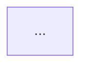

# Explain Diff

Analyze and explain code changes between two branches using only git. Works with any git repository.

**Rule:** every git command MUST use the `--no-pager` flag (`git --no-pager <command>`) to prevent interactive pager prompts.

## Arguments

The user invoked this with: `$ARGUMENTS`

Parse arguments:
- First token → `FEATURE_BRANCH` (required)
- Second token → `BASE_BRANCH` (optional; see Step 2 if absent)

If `FEATURE_BRANCH` is missing, inform the user and stop: `Usage: /explain-diff <feature-branch> [base-branch]`

## Step 1 — Validate Feature Branch

```bash
git --no-pager rev-parse --verify "$FEATURE_BRANCH" 2>/dev/null
```

If this fails, inform the user that the branch does not exist locally. Suggest they may need to fetch it first, then stop.

## Step 2 — Resolve Base Branch

- If `BASE_BRANCH` was provided as the second argument, use it as-is.
- Otherwise use the current branch: `git --no-pager rev-parse --abbrev-ref HEAD`

## Step 3 — Find the Merge Base

```bash
MERGE_BASE=$(git --no-pager merge-base "$BASE_BRANCH" "$FEATURE_BRANCH")
echo "$MERGE_BASE"
```

**Merged branch detection:** if the feature branch was already merged into the base via a merge commit, `FEATURE_BRANCH` is an ancestor of `BASE_BRANCH`, which makes the diff empty. Detect and compensate:

```bash
if git merge-base --is-ancestor "$FEATURE_BRANCH" "$BASE_BRANCH" 2>/dev/null; then
  # Find the earliest merge commit that brought FEATURE_BRANCH into BASE_BRANCH
  MERGE_COMMIT=$(git --no-pager log --merges --ancestry-path --format="%H" "${FEATURE_BRANCH}..${BASE_BRANCH}" | tail -1)
  if [ -n "$MERGE_COMMIT" ]; then
    # Use the commit just before the merge as the effective base
    MERGE_BASE="${MERGE_COMMIT}^1"
  fi
fi
```

Use `$MERGE_BASE..$FEATURE_BRANCH` for all subsequent diff and log commands.

If `git --no-pager log --oneline "$MERGE_BASE".."$FEATURE_BRANCH"` produces no output, inform the user. If a squash or rebase merge was used, the original commits no longer exist as ancestors and cannot be reconstructed from git history alone. Stop.

## Step 4 — Gather Context

Run all commands before beginning analysis:

```bash
# Commit list
git --no-pager log --oneline "$MERGE_BASE".."$FEATURE_BRANCH"

# File-level summary — always run first to understand scope
git --no-pager diff --stat "$MERGE_BASE".."$FEATURE_BRANCH"

# Full unified diff
git --no-pager diff "$MERGE_BASE".."$FEATURE_BRANCH"
```

Read the `--stat` output before proceeding to the full diff. It determines how to approach the analysis (scope, which files matter most, whether to read files individually).

## Step 5 — Read Changed Files

For every file listed in the `--stat` output that is readable (not deleted, not binary), use the Read tool to load the current version from disk. This provides full file context beyond the diff hunks.

Limit individual file reads to files under 500 lines. For larger files, read only the regions surrounding changed hunks — use line-number awareness from the diff `@@` markers.

## Step 6 — Write the Analysis

Structure output as follows. Omit any Analysis subsection if there is nothing notable to say about it.

### Overview

Cover all of:
- **Purpose** — why these changes exist; the problem being solved or feature being added
- **Scope** — how many commits, how many files, which areas of the codebase are touched
- **Approach** — the overall technical strategy taken (e.g., introduced an abstraction layer, migrated to a new API, refactored for testability, added caching)

### Diagrams

Include diagrams that are relevant to the diff. Use Mermaid. Omit a diagram type if it adds no insight for this particular diff. Omit all diagrams if the diff is a single trivial change or 500+ files.

**Sequence diagram** — for changes involving async flows, API calls, event handling, or protocol interactions between components:
````
```mermaid
sequenceDiagram
  ...
```
````

**Class diagram** — for changes to class structure, inheritance, composition, or interface contracts:
````
```mermaid
classDiagram
  ...
```
````

**Flowchart** — for changes to control flow, decision logic, or data pipelines:
````

````

### Analysis

#### Design
Architectural patterns, API contract changes, abstractions introduced or removed, coupling and cohesion impact, adherence to SOLID principles.

#### Performance
Time/space complexity changes, N+1 query risks, caching behavior, I/O patterns, resource allocation, hot-path impact.

#### Concurrency
Thread safety, race conditions, synchronization primitives, async/await correctness, shared mutable state, deadlock risks.

#### Tests and Testability
Test coverage of the changed code, quality of new or modified tests, whether new code is easy to test, missing test cases for edge cases or error paths.

#### Controversial Points
Non-obvious design decisions that could reasonably be challenged, trade-offs made without explicit justification, naming or structural choices that may surprise future maintainers.

#### Clean Code
Naming clarity, DRY violations, single responsibility, function length, error handling hygiene, readability.

### Verdict

One of:
- **No issues** — changes look correct and clean as-is.
- **Minor suggestions** — non-blocking improvements noted in the analysis above.
- **Review required** — blocking concerns that should be addressed before merging.
- **Breaking changes** — backwards-incompatible API or behavior changes detected; call out specifically what breaks.

## Edge Cases

- **Branch not found locally**: inform user and stop; suggest `git fetch`
- **No commits ahead of base**: inform user and stop
- **Already-merged branch (merge commit)**: detected via ancestry check; `MERGE_COMMIT^1` used as effective base so the diff reflects the original changes
- **Already-merged branch (squash/rebase)**: `FEATURE_BRANCH` is NOT an ancestor of `BASE_BRANCH`; diff works normally against the resolved merge base
- **Deleted files**: note in analysis; no Read needed
- **Binary files** (images, lock files, compiled assets): note by name; skip content analysis
- **Renamed files**: treat as a move; focus analysis on content changes within the rename
- **Large diffs** (500+ files): summarize at directory level; skip per-file reads; omit Diagrams
